# CLOUD-desafioG3
Submódulo para el desarrollo de la parte de cloud &amp; DevOps del proyecto "Desafio-theBridge-sep23-grupo3"

## Variables de entorno:

Documentación: https://learn.microsoft.com/en-us/azure/app-service/reference-app-settings?tabs=kudu%2Cdotnet

## Power BI en web apps

https://www.youtube.com/watch?v=XSAHwE21Buk

## Creación de pipeline CI/CD

### paso 1 - Creación de un "container registry"

### Paso 2 - Pipeline artefacto:

Crea nueva pipeline desde un repositorio de github. Una vez seleccionado el repositorio deseado, seleccionamos la opción de "**Docker** *Build and push an image to azure container registry*":

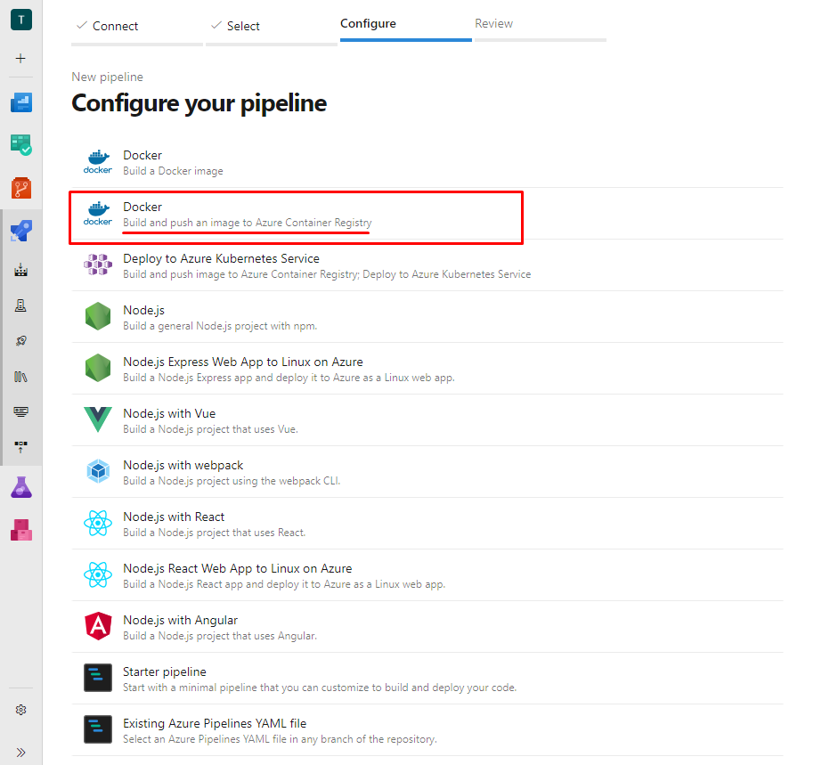

Ahora seleccionamos la suacripción donde tenemos nuestro registro de contenedores y rellenamos con el nombre de la imagen que vamos a crear y la ubicación del Dockerfile dentro de nuestro repositorio:

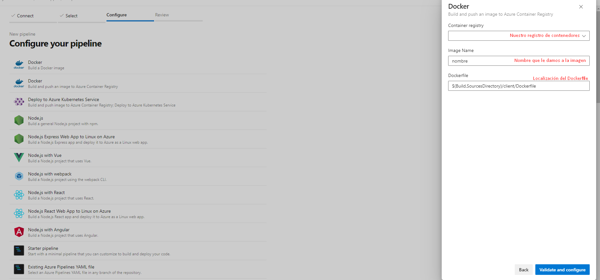

Finalizamos revisando que la información del YAML es correcta y ejecutamos la pipeline.

### Paso 3 - Release Pipeline de desarrollo:

En despliegues, vamos a crear una nueva pipeline de despliegue y elegimos la plantilla de *Azure App Service Deployment*

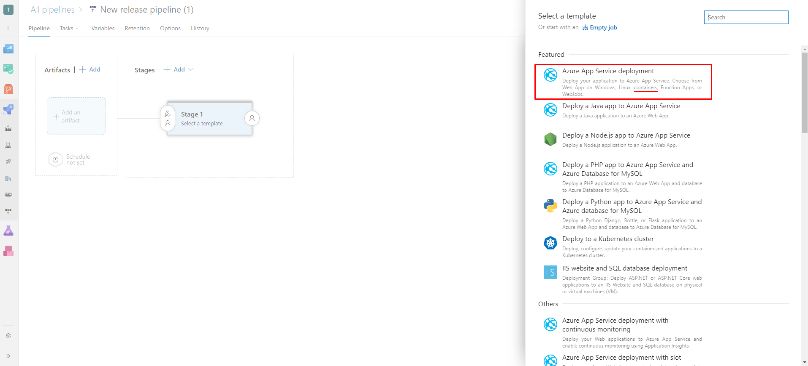

Agrgaremos el artefacto que creamos en la pipeline con github y activamos el trigger de implementación continua:

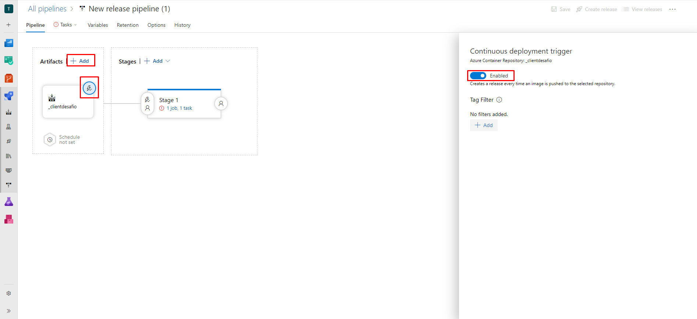

Seguidamente modificamos las condiciones de pre-despliegue para que se lance solo con una nueva version de nuestra imagen:

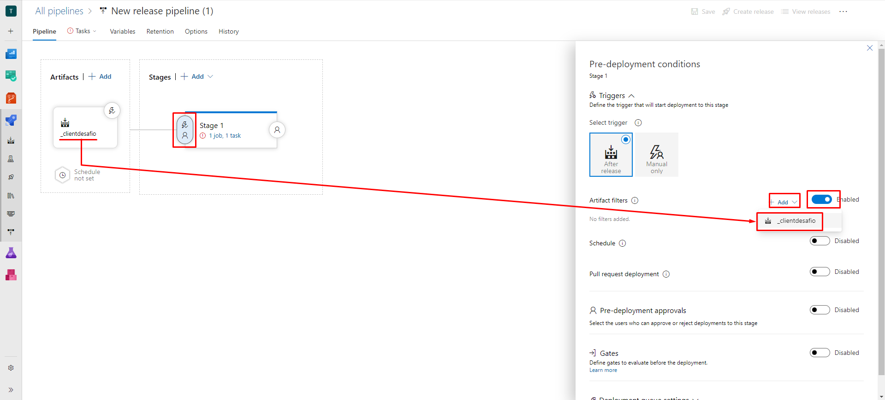

Antes de preparar las tareas, vamos a preparar unas cuantas variables:

- app-service-plan-name: Nombre del *service plan* que vamos a crear
- app-service-name: Nombre de la *web app* que estamos creando
- container-registry: El registro donde se encuentra la imagen del contenedor
- container-image-name: El nombre de la imagen del contenedor
- resource-group-name: El grupo de recursos donde estamos trabajando

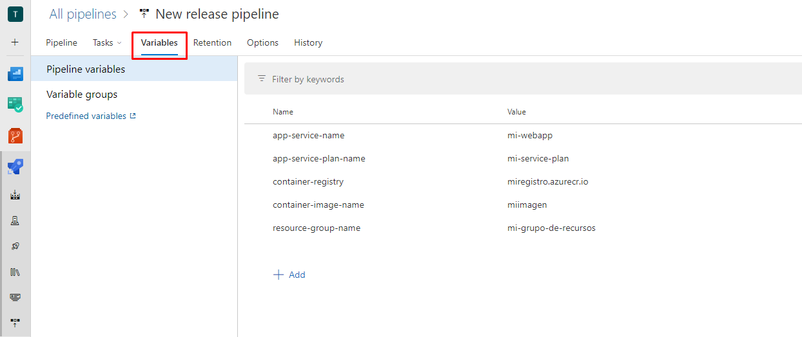

Ahora nos concentramos en las tareas. En primer lugar rellenamos los parámetros requeridos del escenario *stage 1*, asegurandonos que elegimos el tipo *Web App for Containers (Linux)*:

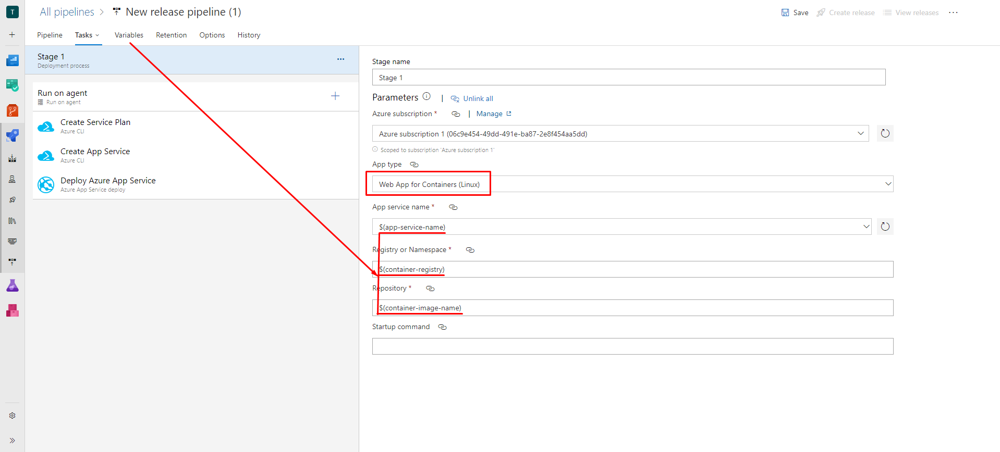

A continuación modificaremos el agente de ejecución para que utilice ubuntu:

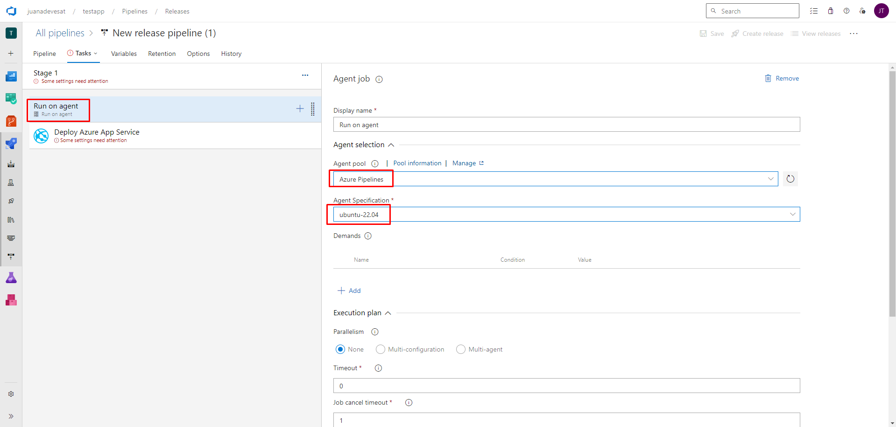

Es hora de crear nuestro *app service plan*. Para ello creamos una tarea de *Azure CLI* e introducimos el comando siguiente:

```
az appservice plan create -n $(app-service-plan-name) -g $(resource-group-name) --sku F1 --is-linux
```

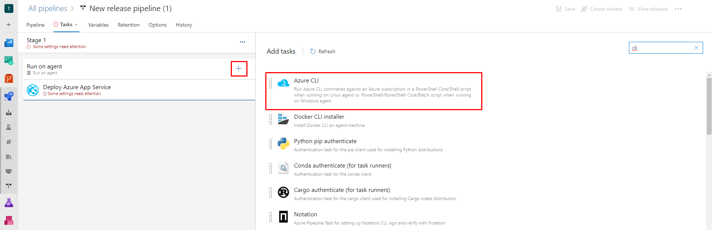
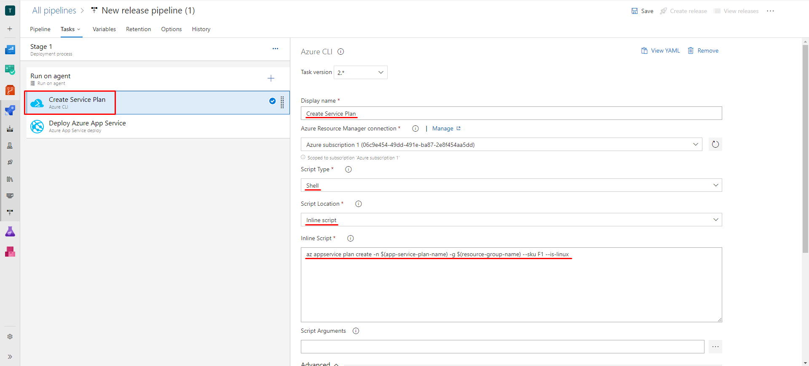

Ahora toca crear nuestro App service utilizando otra tarea de *Azure CLI* y el siguiente comando:

```
az webapp create -n $(app-service-name) -p $(app-service-plan-name) -g $(resource-group-name) -i $(container-registry)/$(container-image-name) --public-network-access Enabled
```

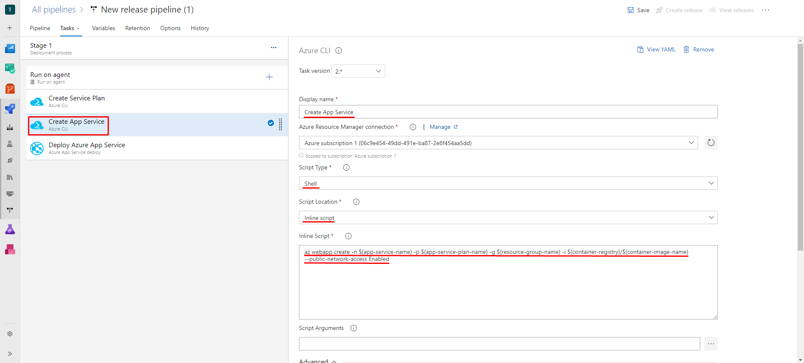

Seguidamente modificaremos el Deploy Azure App Service para introducir el puerto por el que se expone la imagen en el apartado *Application and Configuration Settings*:

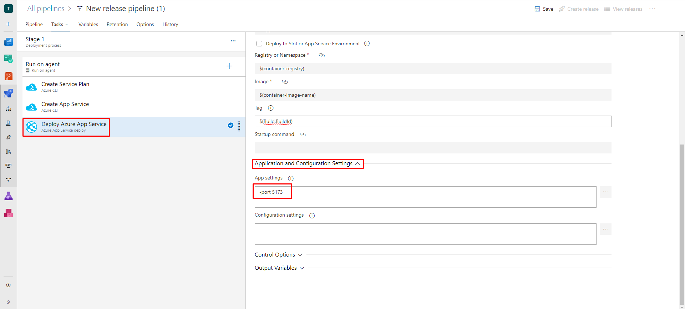

FALTAN LOS TESTS