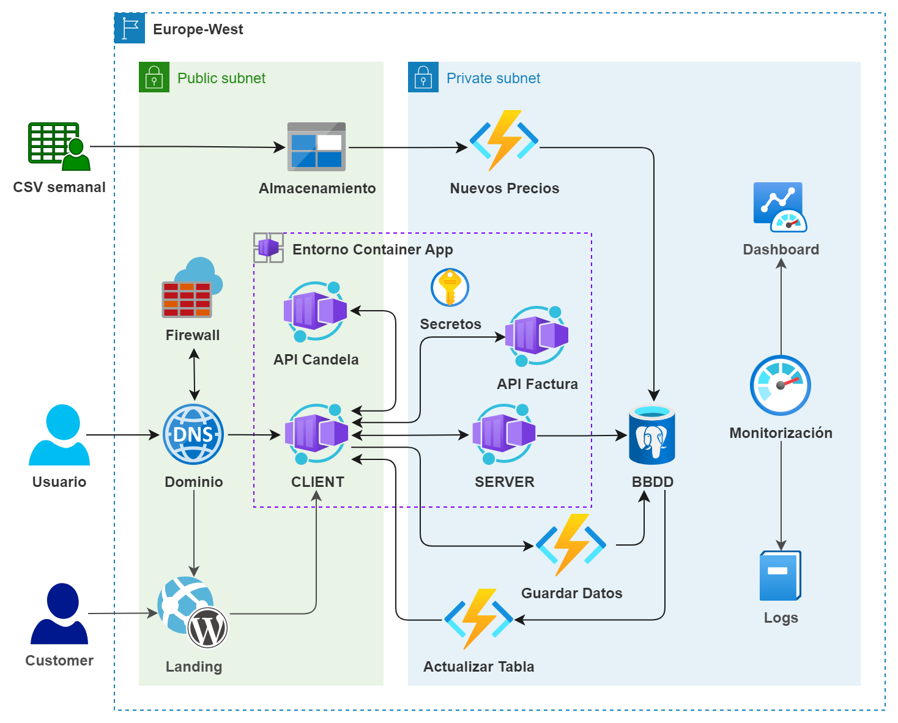

***
# DESAFIO DE TRIPULACIONES - THE BRIDGE
## Grupo 3 - Cloud & DevOps   

### Indice:

1. [Gestión de permisos y control de versiones](##1.-Gestión-de-permisos-y-control-de-versiones:)

2. [Diseño de la Arquitectura](##2.-Diseño-de-la-Arquitectura)

3. [Infraestructura como código (IaC)](##3.-Infraestructura-como-código-(IaC))

4. [Despliegue e implementación contínuos (CI/CD)](##4.-Despliegue-e-implementación-contínuos-(CI/CD))

5. [Monitorización](##5.-Monitorización)

6. [Memoria de proyecto](##6.-Memoria-de-proyecto)

## 1. Gestión de permisos y control de versiones:

Para limitar a la mínima cantidad de usuarios que puedan alterar la infraestrucura desplegada, los permisos de acceso a la plataforma de Azure se limitarón a los imprescindibles para cada vertical. Para poder asignar permisos en bloque, el comienzo de ésta fase consistió en crear tres grupos de usuarios, uno para ciberseguridad, uno para data science y uno para full-stack; y a crear cuentas de invitado a los miembros del equipo que tendrán acceso.

Para facilitar la comprensión de la plataforma de azure y el funcionamiento de ésta, a todos los miembros de las verticales técnicas se les ha asignado el rol de "reader" sobre la suscripción al completo. El enfoque a la hora de asignar permisos ha tenido en cuenta tanto el desconocimiento de la plataforma por parte del resto de compañeros, como la buena práctica de configurar nuestra arquitectura utilizando código como infraestructura. De ésta forma se llegó a la conclusión que no deberían de recibir ningún permiso adicional, a menos que se presentase la necesidad. La excepción ha sido la vertical de ciberseguridad, a la cuál, una vez documentados sobre la nube de azure, se les asignó los roles de *Security Admin* y *App Compliance Automation Administrator* para poder mantener monitorizada la aplicación.

Se ha tomado un enfoque similar a la hora de aprovisionar el grupo con control de versiones. Utilizando github, se ha creado una organización para albergar el proyecto. Se creó un repositorio principal para el trabajo de puesta en común entre verticales y entorno de desarrollo, y submódulos para que cada vertical tenga un espacio aislado donde desarrollar entre ellos. Finalmente, un último submódulo para albergar la versión de la aplicación que se despliega en producción. 

Para gestionar los permisos se han creado equipos dentro de la organización, de tal forma que cada vertical tenga permisos de lectura sobre todo el proyecto, pero solo permisos de escritura sobre su propio repositorio y la rama principal. Finalmente, la rama de producción no pertenece a ningún equipo y solo tienen permiso de escritura sobre el la vertical de cloud, que se encargan de desplegar la app.

## 2. Diseño de la Arquitectura

### Arquitectura lograda durante la fase 1:


El diagrama muestra de forma esquemática nuestra arquitectura actualmente desarrollada. Consiste en una orquestación de contenedores, utilizando azure container apps, conectada a una base de datos de PostgreSQL, y apoyada por APIs que se despliegan en Azure Functions. Vamos a analizar cada elemento:

**Region**: Nos limitamos a una sola región debido al uso exclusivo dentro de España. Si la empresa expande al mercado internacional, se puede plantear una arquitectura multi-región.

**Usuario**: Asesor de Several que utiliza la tabla como herramienta de trabajo.

**Entorno Container Apps**: Espacio donde los contenedores están interconectados entre ellos, y permitiendo el escalado horizontal.

**Client**: Front-end de React, contenida en Docker y desplegada con container apps.

**Server**: API para el backend, contenida en una imágen de Docker y desplegada con container apps.

**API Factura**: API para interpretar una factura en pdf o imágen y devolver al client los datos para poblar la tabla.

**API Candela**: API para automatizar la recuperación de datos desde la web de Candela, utilizando el CUPS.

**BBDD**: La base de datos de PostgreSQL, levantada en un servidor de Azure. Genera copia de seguridad periódicamente.

**Backup**: Copia de seguridad automática realizada por la base de datos. 

**Secretos**: Container Apps tiene la función de guardar secretos para que cuando esa información se requiera, esté encriptada.

**Monitorización**: Analitica de logs y visión de un dashboard del estado de la infraestructura.

**Customer**: Potencial cliente que atrae la vertical de marketing.

**Landing**: Web de wordpress desarrollada por marketing para informar a los potenciales clientes de que ofrece la empresa.

### Arquitectura propuesta para fase final

En una fase mas avanzada del proyecto se puede seguir desarrollando la infraestructura para que sea mas segura y con conexiones mas eficientes. Para lograrlo, la API para actualizar la tabla se volvería una Azure function, agregariamos una ingesta de datos que actualice automáticamente la base de datos con los nuevos precios semanales y se implementaría una red virtual pública y otra privada, permitiendo solo acceso a la segunda desde el client. Un firewall protegería el ingress de nuestra aplicación y un Dominio privado aportaría elegancia a la URL. 




## 3. Infraestructura como código (IaC)

Creación de la infraestructura utilizando Terraform y Teraform Cloud para almacenar el estado de nuestra infraestructura y las variables que queremos encriptar. El proces de la creación de la infraestructura se realizó paso a paso, a medida que avanzaba el proyecto.

Los primeros recursos que creamos en la subscripción de Azure son el grupo de recursos y la base de Datos:

**main.tf**:
´´´terraform {
  cloud {
    organization = "Several-energy"
    workspaces {
      name = "Calculadora-Several"
    }
  }
  required_providers {
    azurerm = {
      source  = "hashicorp/azurerm"
      version = "3.87.0"
    }
  }
}

provider "azurerm" {
  subscription_id = "8981aa87-5078-479f-802f-cf78ed73bdf0"
  features {    
    resource_group {
      prevent_deletion_if_contains_resources = true
    }
  }
}


# Grupo de recursos
resource azurerm_resource_group Resource-Group {
  name = local.resource-group-name
  location = local.location
}

# Base de datos
resource "azurerm_postgresql_flexible_server" "pg-flex-server" {
  name                   = var.pg-flex-name
  resource_group_name    = var.resource-group-name
  location               = var.location
  administrator_login    = var.login
  administrator_password = var.password
  storage_mb             = var.storage-mb
  sku_name               = var.sku-name
  zone                   = 1
  
  lifecycle {
    prevent_destroy = true
  }
}
´´´

Con una imagen de Docker vacia podemos crear las container apps. Para evitar repetición excesiva, se crea un módulo para el entorno y uno para la creación. Empecemos por crear el entorno de las container apps. Necesitamos un registro de contenedores, log analytics, container app environment y conexión externa para la base de datos (con dapr):

**Modules/Container-apps-environment/main-cont-app-env.tf**:

```terraform
# Container registry
resource "azurerm_container_registry" "my_containers" {
  name                = var.container_registry_name
  resource_group_name = var.resource-group-name
  location            = var.location
  sku                 = "Basic"

  identity {
    type = "SystemAssigned"
  }
}

resource "azurerm_log_analytics_workspace" "ws-log-analytics" {
  name                = var.log_analytics_workspace_name
  location            = var.location
  resource_group_name = var.resource-group-name
}

# Crea el Environment para las container-apps
resource "azurerm_container_app_environment" "container_env" {
  name                       = var.container_app_environment_name
  location                   = var.location
  resource_group_name        = var.resource-group-name
  log_analytics_workspace_id = azurerm_log_analytics_workspace.ws-log-analytics.id
}

# Conexión dapr para base de datos
resource "azurerm_container_app_environment_dapr_component" "dapr" {
  component_type               = var.dapr_component_type
  container_app_environment_id = azurerm_container_app_environment.container_env.id
  name                         = var.dapr_component_name
  version = "v1"
}
```


**Modules/Container-apps-environment/output-cont-app-env.tf**:

```terraform
output "container-registry-prin-ID" {
  value = azurerm_container_registry.my_containers.identity[0].principal_id
}

# container_app_environment_id
output "container_app_environment_id" {
  value = azurerm_container_app_environment.container_env.id
}

# dapr_app_id
output "dapr_app_id" {
  value = azurerm_container_app_environment_dapr_component.dapr.name
}

```

Ahora que tenemos el entorno configurado, podemos crear los contenedores vacios. Los poblaremos con código en nuestra pipeline mas adelante:

**Modules/Container-apps/main-cont-app.tf**:

```terraform
resource "azurerm_container_app" "container_app" {
  for_each = var.container_app

  container_app_environment_id = var.container_app_environment_id
  name                         = each.value.name
  resource_group_name          = var.resource-group-name
  revision_mode                = "Single"

  template {
    max_replicas    = each.value.template.max_replicas
    min_replicas    = each.value.template.min_replicas

    container {
      image   = each.value.template.image
      name    = each.value.template.name
      cpu     = each.value.template.cpu
      memory  = "${each.value.template.memory_gigaBytes}Gi"

      dynamic "env" {
        for_each = each.value.template.env

        content {
          name        = env.value["name"]
          secret_name = env.value["secret_name"]
        }
      }
    }

    http_scale_rule {
      name = each.value.http_scale_rule.name
      concurrent_requests = each.value.http_scale_rule.concurrent_requests
    }
  }

  dapr {
    app_id = var.dapr_app_id
  }

  ingress {
    target_port                = each.value.ingress.target_port
    allow_insecure_connections = each.value.ingress.allow_insecure_connections
    external_enabled           = each.value.ingress.external_enabled
    transport                  = "http"

    traffic_weight {
      percentage = 100
      latest_revision = true
      }
  }

  dynamic "secret" {
    for_each = each.value.secret

    content {
      name  = secret.value["name"]
      value = secret.value["sec-value"]
    }
  }

  identity {
    type = "SystemAssigned"
  }

  timeouts {
    create = "20m" # Set the create timeout to 20 minutes
  }
}
```

**Modules/Container-apps/variables-cont-app.tf**

```terraform
variable "container_app_environment_id" {
  type        = string
  description = "(Required) ID del entorno donde se desplegará."
  nullable    = false
}

variable "location" {
  type = string
}

variable "resource-group-name" {
  type        = string
  description = "(Required) The name of the resource group in which the resources will be created."
  nullable    = false
}

variable "dapr_app_id" {
  type        = string
  description = "(Required) ID del dapr binding con el que se conecta."
  nullable    = false
}

variable "container_app" {
  default     = {}
  description = "(Optional) The Dapr component to deploy."
  nullable    = false

  type = map(object({
    name = string,

    template = object({
      max_replicas    = optional(number),
      min_replicas    = optional(number),

      image             = string,
      name              = string,
      cpu               = optional(number),
      memory_gigaBytes  = optional(number),

      env = optional(list(object({
        name        = string,
        secret_name = string,
      })))
    }),

    http_scale_rule = optional(object({
      name = string
      concurrent_requests = number
    }))

    ingress = optional(object({
      target_port                = number,
      allow_insecure_connections = optional(bool, false),
      external_enabled           = optional(bool, false),
    })),

    secret = optional(list(object({
      name  = string,
      sec-value = string,
    }))),
  }))
}
```

**Modules/cont-apps/output.tf**:

```terraform
output "url" {
  value = [ for name, container in azurerm_container_app.container_app : "https://${try(container.ingress[0].fqdn, "")}" if can(container.ingress[0].fqdn) ]
}
```

Ya tenemos nuestros módulos. Ahora podemos ejecutarlos para conseguir nuestra arquitectura:

**main.tf**:

```terraform
# Creación del entorno para Container Apps
module "container_app_environment" {
  source = "./Modules/Container-apps-environment"
  location = local.location
  resource-group-name = local.resource-group-name
  container_registry_name = local.container_registry_name
  container_app_environment_name = local.container_app_environment_name_dev
  dapr_component_type = local.dapr_component_type
  dapr_component_name = local.dapr_component_name
}

# Creación de la API candela
module "Container_app_candela_dev" {
  source = "./Modules/Container-apps"
  location = local.location
  resource-group-name = local.resource-group-name
  container_app_environment_id = module.container_app_environment.container_app_environment_id
  dapr_app_id = module.container_app_environment.dapr_app_id
  container_app = local.container_app_candela_dev
  depends_on = [ module.container_app_environment ]
}

# Creación de la API invoice
module "Container_app_invoice_dev" {
  source = "./Modules/Container-apps"
  location = local.location
  resource-group-name = local.resource-group-name
  container_app_environment_id = module.container_app_environment.container_app_environment_id
  dapr_app_id = module.container_app_environment.dapr_app_id
  container_app = local.container_app_invoice_dev
  depends_on = [ module.container_app_environment ]
}

# Creación de la API invoice
module "Container_app_update_dev" {
  source = "./Modules/Container-apps"
  location = local.location
  resource-group-name = local.resource-group-name
  container_app_environment_id = module.container_app_environment.container_app_environment_id
  dapr_app_id = module.container_app_environment.dapr_app_id
  container_app = local.container_app_update_dev
  depends_on = [ module.container_app_environment ]
}

# Creación de server
module "Container_app_server_dev" {
  source = "./Modules/Container-apps"
  location = local.location
  resource-group-name = local.resource-group-name
  container_app_environment_id = module.container_app_environment.container_app_environment_id
  dapr_app_id = module.container_app_environment.dapr_app_id
  container_app = local.container_app_server_dev
  depends_on = [ module.container_app_environment, module.database ]
}

# Creación de client
module "Container_app_client_dev" {
  source = "./Modules/Container-apps"
  location = local.location
  resource-group-name = local.resource-group-name
  container_app_environment_id = module.container_app_environment.container_app_environment_id
  dapr_app_id = module.container_app_environment.dapr_app_id
  container_app = local.container_app_client_dev
  depends_on = [ module.container_app_environment, module.Container_app_candela_dev, module.Container_app_invoice_dev, module.Container_app_server_dev ]
}
```

Aprovechamos los outputs de nuestros primeros cuatro contenedores para designar al client las URL mediante variables de entorno. Estas URL serán la ruta que llamarán a Server, a la API de candela y a la Api de facturas.

**locals.tf**:

```terraform
locals {
  # General
  resource-group-name = "RECURSOS-desafiotripulacionesG3"
  location = "westeurope"

  # Database
  pg-flex-name = "database-desafio-grupo3"

  # Entorno para Containers
  container_registry_name = "SeveralEnergyCalculadora"
  log_analytics_workspace_name_dev = "Log-analytics-DEV"
  container_app_environment_name_dev = "env-container-apps-dev"
  dapr_component_type = "bindings.postgresql"
  dapr_component_name = "databaseconnect"

  # API de Candela
  container_app_candela_dev = {API-candela = {
      name = "ws-candela-dev"

      template = {
        min_replicas     = 1
        max_replicas     = 5
        image            = "mcr.microsoft.com/azuredocs/aci-helloworld"
        name             = "wscandeladev"
        cpu              = 0.5
        memory_gigaBytes = 1

        env = [
              {name  = "URL_CANDELA"
              secret_name = "url-candela"},
              {name  = "USER_CANDELA"
              secret_name = "user-candela"},
              {name  = "PWD_CANELA"
              secret_name = "password-candela"}
        ]
      }

      http_scale_rule = {
        name                = "http-candela"
        concurrent_requests = 5
      }

      ingress = {
        target_port                = 5000
        allow_insecure_connections = false
        external_enabled           = true
      }

      secret = [
        {name = "url-candela"
        sec-value = "https://agentes.candelaenergia.es/#/login"},
        {name = "user-candela"                                      # Almacenado como terraform variable
        sec-value = var.USER_CANDELA},
        {name = "password-candela"                                  # Almacenado como terraform secret
        sec-value = var.PWD_CANDELA}
      ]
    }
  }

  # API de facturas
  container_app_invoice_dev = {API-invoice = {
      name = "ws-invoice-dev"

      template = {
        min_replicas     = 1
        max_replicas     = 5
        image            = "mcr.microsoft.com/azuredocs/aci-helloworld"
        name             = "wsinvoicedev"
        cpu              = 0.5
        memory_gigaBytes = 1

        env = []
      }

      http_scale_rule = {
        name                = "http-invoice"
        concurrent_requests = 5
      }

      ingress = {
        target_port                = 5001
        allow_insecure_connections = false
        external_enabled           = true
      }

      secret = []
    }
  }

# Servidor backend
  container_app_server_dev = {server-cont = {
      name = "dev-server"

      template = {
        min_replicas     = 1
        max_replicas     = 5
        image            = "mcr.microsoft.com/azuredocs/aci-helloworld"
        name             = "server-develop"
        cpu              = 0.5
        memory_gigaBytes = 1

        env = [
              {name  = "SQL_USER"
              secret_name = "sqluser"},
              {name  = "SQL_PWD"
              secret_name = "sqlpwd"},
              {name  = "SQL_HOST"
              secret_name = "sqlhost"},
              {name  = "SQL_DATABASE"
              secret_name = "sqldatabase"},
              {name  = "JWT_SECRET"
              secret_name = "jwtsecret"},
              {name  = "SESSION_SECRET"
              secret_name = "sessionsecret"}
              ]
      }

      http_scale_rule = {
        name                = "http-server"
        concurrent_requests = 5
      }

      ingress = {
        target_port                = 3000
        allow_insecure_connections = false
        external_enabled           = true
      }

      secret = [
        {name = "sqluser"                  # Almacenado como terraform secret
        sec-value = var.PG-ADMIN-USER},
        {name = "sqlpwd"                   # Almacenado como terraform secret
        sec-value = var.PG-ADMIN-PWD},
        {name = "sqlhost"                  # Proporcionado por output
        sec-value = module.database.host},
        {name = "sqldatabase"
        sec-value = "proyectoTribu"},
        {name = "jwtsecret"                # Almacenado como terraform secret
        sec-value = var.JWT_SECRET},
        {name = "sessionsecret"            # Almacenado como terraform secret
        sec-value = var.SESSION_SECRET}
        ]
    },
  }

# Servidor frontend
  container_app_client_dev = {client-cont = {
      name = "client-develop"

      template = {
        min_replicas     = 1
        max_replicas     = 5
        image            = "mcr.microsoft.com/azuredocs/aci-helloworld"
        name             = "client-dev"
        cpu              = 0.5
        memory_gigaBytes = 1

        env = [
              {name  = "VITE_SERVER_URL"
              secret_name = "viteserver"},
              {name  = "VITE_CANDELA"
              secret_name = "vitecandela"},
              {name  = "VITE_INVOICE"
              secret_name = "viteinvoice"}
        ]
      },

      http_scale_rule = {
        name                = "http-client"
        concurrent_requests = 5
      }

      ingress = {
        target_port                = 5173
        allow_insecure_connections = false
        external_enabled           = true
      }

      secret = [
        {name = "viteserver"
        sec-value = module.Container_app_server_dev.url[0]},
        {name = "vitecandela"
        sec-value = module.Container_app_candela_dev.url[0]},
        {name = "viteinvoice"
        sec-value = module.Container_app_invoice_dev.url[0]}
      ]
    }
  }
}
```

Finalmente, para que nuestra pipeline de a continuación funcione, los contenedores necesitan permiso de ArcPull en el registro de contenedores para utilizar las imágenes.

**main.tf**:

```terraform
# Consultamos la ID de la API candela
data "azurerm_container_app" "data_candela" {
  name = "Container_app_candela_dev"
  resource_group_name = local.resource-group-name
  depends_on = [ module.Container_app_candela_dev ]
}

# Asignamos el permiso a la API candela
resource "azurerm_role_assignment" "rol_candela" {
  scope                = "/subscriptions/8981aa87-5078-479f-802f-cf78ed73bdf0/resourceGroups/${local.resource-group-name}"
  role_definition_name = "ArcPull"
  principal_id         = data.azurerm_container_app.data_candela.identity[0].principal_id
  depends_on = [ data.azurerm_container_app.data_candela ]
}


# Consultamos la ID de la API invoice
data "azurerm_container_app" "data_invoice" {
  name = "Container_app_invoice_dev"
  resource_group_name = local.resource-group-name
  depends_on = [ module.Container_app_invoice_dev ]
}

# Asignamos el permiso a la API invoice
resource "azurerm_role_assignment" "rol_invoice" {
  scope                = "/subscriptions/8981aa87-5078-479f-802f-cf78ed73bdf0/resourceGroups/${local.resource-group-name}"
  role_definition_name = "ArcPull"
  principal_id         = data.azurerm_container_app.data_invoice.identity[0].principal_id
  depends_on = [ data.azurerm_container_app.data_invoice ]
}


# Consultamos la ID de server
data "azurerm_container_app" "data_server" {
  name = "Container_app_client_dev"
  resource_group_name = local.resource-group-name
  depends_on = [ module.Container_app_server_dev ]
}

# Asignamos el permiso a server
resource "azurerm_role_assignment" "rol_server" {
  scope                = "/subscriptions/8981aa87-5078-479f-802f-cf78ed73bdf0/resourceGroups/${local.resource-group-name}"
  role_definition_name = "ArcPull"
  principal_id         = data.azurerm_container_app.data_server.identity[0].principal_id
  depends_on = [ data.azurerm_container_app.data_server ]
}


# Consultamos la ID de client
data "azurerm_container_app" "data_client" {
  name = "Container_app_client_dev"
  resource_group_name = local.resource-group-name
  depends_on = [ module.Container_app_client_dev ]
}

# Asignamos el permiso a client
resource "azurerm_role_assignment" "rol_client" {
  scope                = "/subscriptions/8981aa87-5078-479f-802f-cf78ed73bdf0/resourceGroups/${local.resource-group-name}"
  role_definition_name = "ArcPull"
  principal_id         = data.azurerm_container_app.data_client.identity[0].principal_id
  depends_on = [ data.azurerm_container_app.data_client ]
}
```

## 4. Despliegue e implementación contínuos (CI/CD)

Para garantizar una suave transición entre las distintas fases del proyecto, por cada contenedor se ha creado una pipeline de implementación continua (CI) utilizando github, Azure container registry, y Azure DevOps. Los repositorios de github están separados por vertical, logrando un trabajo enfocado a la especialidad de cada vertiente. Además se ha habilitado un repositorio común para colaboraciones y despliegue de la pipeline de desarrollo. 

Cuando una versión está lista para pruebas, se hace un push a la rama main para activar la pipeline. En ese momento, Azure DevOps contenedoriza el código de la Api y la sube al registro de contenedores, empezando así el proceso de actualización de la app. 


Despues de las pruebas, si hay errores, el desarrollador arreglará los fallos y volverá a empezar la pipeline hasta que se logre una versión estable. Cuando esto se consiga, el responsable de la pipeline sincronizará el repositorio de producción con el repositorio de desarrollo, desencadenando así la pipeline de despliegue continuo (CD) que creará su propia versión de la app, dejando libre así la pipeline de desarrollo para seguir trabajando.

Las pipelines todas tienen el mismo fichero .yaml, solo diferenciandose por los parámetros que las diferencian (Nombre del contenedor y nombre de la API):

**Ejemplo de la pipeline para client-severalenergy-dev**:
```yaml
# Docker
# Build and push an image to Azure Container Registry
# https://docs.microsoft.com/azure/devops/pipelines/languages/docker

trigger:
  branches:
    include:
      - main
  paths:
    include:
      - client

resources:
- repo: self

variables:

  # VARIABLES ENTRE PIPELINES
  # ---------------------------------------------------------------------------
  DEPLOY-STAGE: 'dev'
  API-TO-DEPLOY: 'client'
  # ---------------------------------------------------------------------------

# Container registry service connection established during pipeline creation
  dockerRegistryServiceConnection: '7518cb5a-e004-4437-b18b-f7c98ae1c8cb'
  imageRepository: '$(API-TO-DEPLOY)-severalapp'
  registryname: 'severalcontainers-$(DEPLOY-STAGE)'
  containerRegistry: '$(registryname).azurecr.io'
  dockerfilePath: '**/$(API-TO-DEPLOY)/Dockerfile_client'
  tag: '$(DEPLOY-STAGE).$(Build.BuildId)'

  # Container Apps Variables
  azureSubscription: 'conexion-azure-cloud'
  resourceGroup: 'RECURSOS-severalenergy-$(DEPLOY-STAGE)'
  containerAppEnvironment: 'containerenvironment-severalenergy-$(DEPLOY-STAGE)'
  containerAppName: '$(API-TO-DEPLOY)'

  # Agent VM image name
  vmImageName: 'ubuntu-latest'

stages:
- stage: Build
  displayName: Build and push stage
  jobs:
  - job: Build
    displayName: Build
    pool:
      vmImage: $(vmImageName)
    steps:

    # Tarea que contenedoriza el código de
    - task: Docker@2
      displayName: Build and push an image to container registry
      inputs:
        command: buildAndPush
        repository: $(imageRepository)
        dockerfile: $(dockerfilePath)
        containerRegistry: $(dockerRegistryServiceConnection)
        tags: |
          $(tag)

    # Tarea que crea una nueva revisión de la Api contenedorizada
    - task: AzureContainerApps@1
      displayName: Update Container App
      inputs:
        azureSubscription: $(azureSubscription)
        location: europewest
        acrName: $(registryname)
        imageToDeploy: $(containerRegistry)/$(imageRepository):$(tag)
        resourceGroup: $(resourceGroup)
        containerAppEnvironment: $(containerAppEnvironment)
        containerAppName: $(containerAppName)
        disableTelemetry: false
```

## 5. Monitorización


## 6. Memoria de proyecto

Y finalmente, la realidad del dia a dia en este desafio. No todo es del color de rosas como está expuesto arriba, pero se ha logrado un producto decente a pesar de los contratiempos.

### 08 de enero, 2024

- Primera reunión con Cliente
- Crear usuarios invitados y grupos de seguridad en suscripción de azure para Data, Ciber y Fullstack
- Gestionar permisos sobre el grupo de recursos para cada grupo de seguridad
- Reunión con Ciber: 
    - Decisión de crear una imágen de Docker securizada de alpine 3.19 como base para los despliegues
    - Pentest de máquina virtual hola, mundo
- Creación de servidor para base de datos PostgreSQL

### 09 de enero, 2024

- Creación de container registry
- Creación de pipeline para creación de imágenes de client y server
- Comienza pipeline de despliegue para app service de client y server pre-producción
- Reunión con Data:
    - Propuesta de Api Centers para api de actualización de la tabla con Azure Functions
- Reunión con Ciber:
    - Backup de la base de datos
    - Logs para ciber

### 10 de enero, 2024

- Reunión con Ciber:
    - Intento de despliegue automático de sonarqube en pipeline. Conclusión: ejecución en local no tiene acceso a Azure Pipelines. Ciber busca solución con repo en local.
    - Plantilla de imágen Iron-Alpine encontrada. Test de la imágen, todo funcional.
- Reunión con Data:
    - Idea de Api para actualización automática de la tabla. La Api solo actualizará campos complejos. Los campos sencillos de la tabla se manejan desde front end.
    - Necesidad de Hostear Api para el scrapping de Candela. Azure Functions usa container apps para funciones de requerimientos complejos. Valorar utilizar container apps para la arquitectura.
- Bloqueo de pipeline de despliegue por exceso de intentos fallidos. Desbloqueo en 48 horas. Solución temporal: ejecución manual del despliegue a petición de FULLSTACK.


### 11 de enero, 2024

- Reunión con Ciber:
    - Recibido documento hardening-v3. Implementados los cambios en el Dockerfile listo para desplegar.
    - Crear firewall y VPC publica y privada.
- Continuación con host de API scraping

### 12 de enero, 2024

- ALERTA! Gastos de Firewall desorbitados. Recurso eliminado.
    - Descartado el uso de firewall en la fase inicial.
    - Proponer a ciber un estudio teórico para que la empresa lo valore en el futuro.
- Pipeline para API de webscrapping candela
- Variables de entorno para API webscrapping
- Reunión con Data:
    - Colaborar para completar API de webscrapping (Container Apps)
    - Desplegar endpoints (Cloud functions vs container apps)
- Reunión con Fullstack:
    - Hosting API de guardado con API centers (container apps)
    - Preparar variables de entorno y secretos
    - Prueba versión 1.0 de server estable

### 13 de enero, 2024

- Completar pipeline de CI/CD para Client y Server utilizando container apps
- Reunión con Data:
    - Desplegar APIs para la tabla
- Diseño de esquema Arquitectura final.


### 14 de enero, 2024

- comienza el desarrollo de infraestructura como código para nuevo client, nuevo server y primer despliegue de candela y lectura de factura, utilizando terraform
- Reunión con Data:
    - Intentar solucionar bugs de Api de lectura de facturas.
- Pipeline de producción a la espera de IaC y version estable.

### 15 de enero, 2024

- Continua IaC con terraform.
- Ciber entrega nueva revisión de Dockerfile securizado. No funciona.
- Problemas de permisos debido a CORS. 

### 16 de enero, 2024

- Versión de front end 1.0 conectada con back end satisfactoriamente.
- Completar ficheros de IaC. Todavia no hay despliegue de producción.
- Primer despliegue de IaC. Causa problemas

### 17 de enero, 2024

- IaC sigue causando problemas. Valorando empezar despliegues desde cero.
- Documentación, ajuste de diagrama a propuesta real conseguida y memorias.